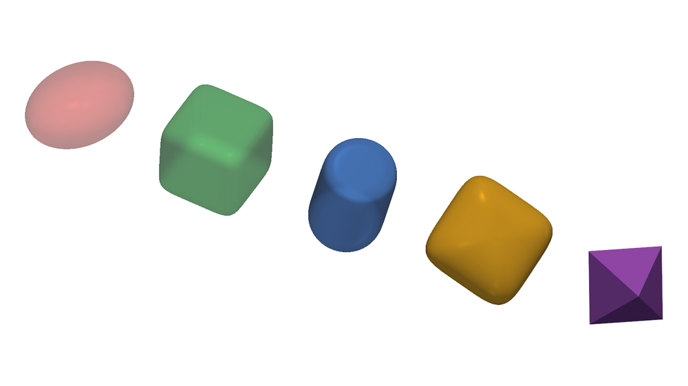
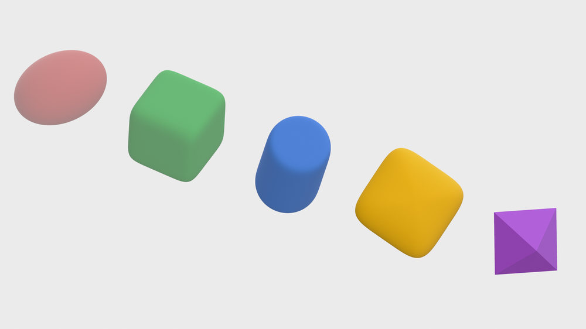

# superquadrics

Superquadric geometry and Open3D / PyVista visualization.

## Install

Pick the plotting backend you want:

```bash
pip install -e ".[pyvista]"   # PyVista backend (supports transparency)
pip install -e ".[open3d]"    # Open3D backend (supports transparency)
pip install -e ".[viz]"       # both backends
pip install -e .              # geometry only (numpy + scipy)
```

## Usage

```python
import numpy as np
from superquadrics import Superquadric, SuperquadricShape, superquadric_plotter

shape = SuperquadricShape(scales=[1.0, 1.5, 0.8], exponents=[0.6, 0.9])
sq = Superquadric(shape, center=[0, 0, 0],
                  rotation=[0.0, 0.0, 0.0])   # matrix, Euler 'xyz', or [x,y,z,w] quat

print(sq.inside_outside_function(np.array([0.5, 0.0, 0.0])))  # <1 inside, >1 outside
g = sq.grad_inside_outside_wrt_point(np.array([0.7, -0.9, 1.3]))
H = sq.hessian_inside_outside_wrt_point(np.array([0.7, -0.9, 1.3]))

superquadric_plotter(sq, plotter="pyvista")              # or plotter="open3d"
superquadric_plotter(sq, plotter="open3d", opacity=0.5)  # transparency (both backends)
```

## Examples

`examples/visualize.py` renders a row of superquadrics (one per shape family,
driven by the `exponents`) with both backends:

```bash
pip install -e ".[examples]"
python examples/visualize.py --opacity 0.5 --out examples/images
```

|  | PyVista | Open3D |
|---|---|---|
| **Transparent** (opacity ramps up left→right) |  |  |
